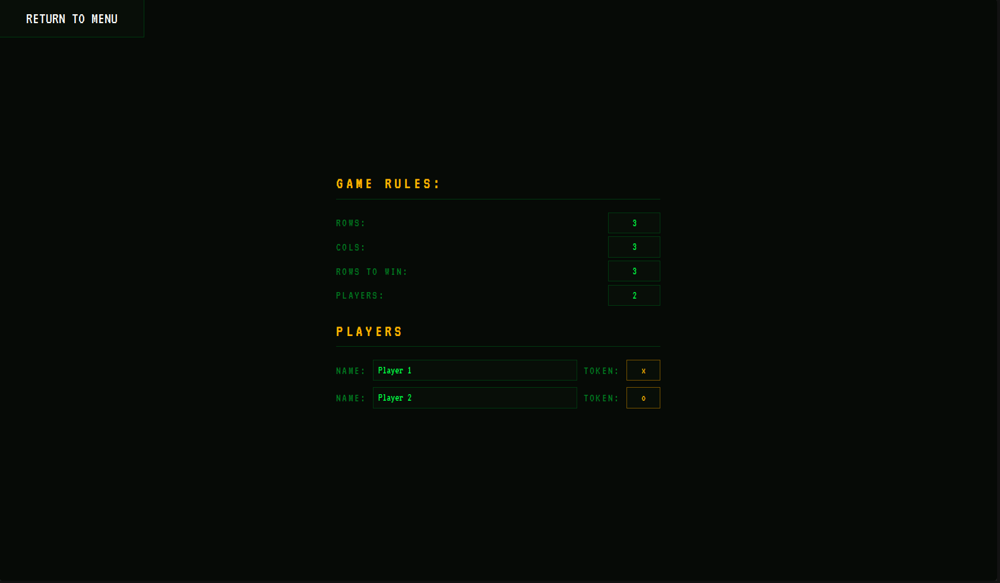

# MNK-Game

a board game where players takes turn placing tokens on a m-by-n board, and the
winner being the player who gets to place their tokens in a k-row.
[Read more here](https://en.wikipedia.org/wiki/M,n,k-game)



<!-- TOC -->

## Table of Contents

- [Preview](#preview)
- [Installation](#installation)
- [Usage](#usage)
- [To-Do](#to-do)
- [Developer's note](#developers-note)
- [Acknowledgments](#acknowledgments)
- [License](#license)

<!-- /TOC -->

## Preview

[MNK-GAME](https://calsjunior.github.io/mnk-game/)

## Installation

1. Clone the repository:

  ```bash
  git clone https://github.com/Calsjunior/mnk-game.git
  ```

2. Open `index.html` in any modern web browser.

## Usage

Press Start Game to play a generic game of mnk where m,n,k are all values of
three.

Press Settings, and you'll be able to customize the size of m, n, k, and even
the amount of players, players' names, and their tokens!

## To-Do

- Add form validation so a game is always winnable.
- ~~Add dynamic column size to fit better when values of m, n are large~~

## Developer's note

The purpose of this project was to learn more about OOP, Functional program,
the [Model-View-Controller](https://en.wikipedia.org/wiki/Model%E2%80%93view%E2%80%93controller)
pattern, and how all three of these can be used together so that code can be a
bit more readable, and maintainable.

## Acknowledgments

This project was completed as a part of [The Odin Project's](https://www.theodinproject.com/) JavaScript curriculum.

## License

[MIT (c) Calsjunior](LICENSE)
